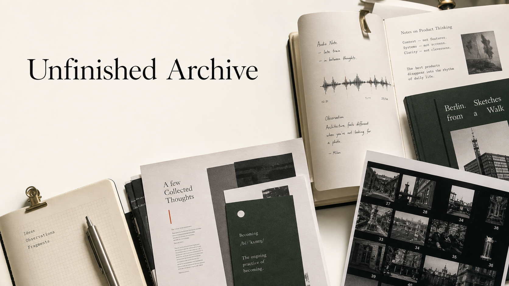

# Unfinished Archive



> An editorial-style personal archive for AI product thinking, creative work, audio notes, travel observations, and the ongoing practice of becoming.
>
> 未完成档案: 一份关于 AI、审美、创作、声音和自我生长的双语个人品牌网站。

[Live site](https://jy2046.github.io/unfinished-archive/) · Built with React, TypeScript, Vite, and a Notion-backed content pipeline.

## Why This Exists

`Unfinished Archive` is not a conventional resume page or a generic creator link hub. It is a public-facing personal brand website designed to make a visitor remember a person: someone who thinks about AI products, builds with taste, makes audio and visual work, and observes cities, tools, and culture with attention.

The project is shaped like an independent culture journal: bilingual, editorial, warm, and intentionally unfinished. It gives recruiters, collaborators, and curious visitors a more textured first impression than a standard portfolio grid.

## What It Shows

- **Personal positioning**: AI product thinker, creator, podcaster, and observer.
- **Selected files**: a curated set of projects, notes, media, and platform links.
- **AI signals**: short observations about AI products, interfaces, tools, and taste.
- **Audio notes**: podcast and audio work presented as part of the brand system.
- **Capability map**: product sense, creative direction, storytelling, AI tooling, and cultural observation.
- **Roaming notes**: city and travel fragments that support the broader archive identity.
- **Bilingual experience**: English and Chinese content with a language toggle.

## Product And Design Direction

The first version aims for an "independent culture journal" feeling rather than a SaaS landing page or resume template.

Design principles:

- Large editorial masthead as the first impression.
- Warm paper-like background, ink typography, deep green and small vermilion accents.
- Real archive/file metaphors instead of generic AI gradients.
- Clear sections that can grow into articles, case notes, or project detail pages later.
- Content that can be updated through Notion while preserving local fallbacks.

## Tech Stack

- React 19
- TypeScript
- Vite
- Vitest
- Playwright
- Testing Library
- Notion API sync script
- GitHub Pages deployment

## Project Structure

```text
src/
  components/          Editorial sections for the homepage
  hooks/               Language and scroll reveal behavior
  notion/              Content transformation and tests
  generated/           Synced Notion content output
  content.defaults.ts  Local fallback content
scripts/
  sync-notion-content.mjs
docs/
  assets/              README and QA visual assets
  superpowers/         Design specs and implementation plans
tests/
  homepage.spec.ts     Playwright coverage
```

## Local Development

```bash
npm install
npm run dev
```

Run checks:

```bash
npm test
npm run build
npm run e2e
```

## Content Sync

The site can sync structured content from Notion:

```bash
npm run sync:notion
```

Create a local `.env` from `.env.example` and provide `NOTION_TOKEN` when syncing live Notion content. If synced content is unavailable, the app falls back to `src/content.defaults.ts`.

## Deployment

```bash
npm run deploy
```

The package homepage points to GitHub Pages:

```text
https://jy2046.github.io/unfinished-archive/
```

## Status

This is a public personal-brand project and an evolving archive. The current version focuses on the single-page experience, editorial system, bilingual presentation, and content pipeline. Future iterations can add article pages, richer project case studies, podcast detail pages, and deeper AI product notes.

## Visual Asset Note

The README banner was generated with an AI image model and committed as a project asset for presentation purposes.
