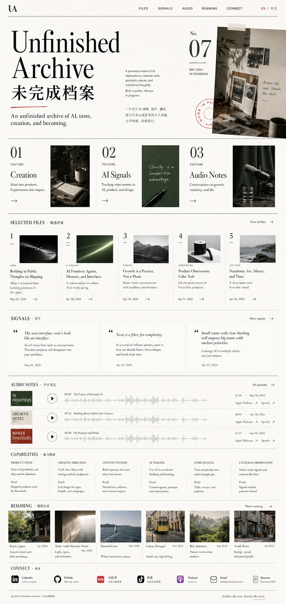

# Unfinished Archive / 未完成档案 Design Spec

Date: 2026-06-13

## Purpose

`Unfinished Archive / 未完成档案` is a bilingual personal brand website for an AI product thinker, designer/creator, podcaster, and observer.

The site should not read as a conventional resume page or a generic creator link hub. It should feel like a refined independent culture journal: a curated archive of AI observations, creative work, audio projects, places, and unfinished thoughts.

Primary impression:

> A person with taste, creative potential, AI product curiosity, and a distinctive way of seeing the world.

Primary audience:

- Broad personal brand audience.
- People arriving from GitHub, LinkedIn, Xiaohongshu, Douyin, podcasts, or future collaborations.
- Recruiters or collaborators should still be able to understand capability and contact paths, but the site should not be optimized only for job search.

Primary user actions:

- Remember the brand and person.
- Browse selected creations and notes.
- Follow external channels.
- Contact for collaboration, conversation, or opportunities.

## Selected Visual Direction

Chosen concept: `Independent Culture Journal`

Reference image:



The chosen direction is an independent culture magazine homepage. It combines editorial polish with creator warmth. It should feel intentional, cultured, slightly experimental, and usable.

Visual qualities:

- Editorial masthead as the first-viewport signal.
- Warm white paper-like background.
- Ink-black typography.
- Deep forest green, silver gray, and small vermilion accents.
- Fine horizontal rules, issue numbers, file labels, and table-of-contents patterns.
- Strong typography, asymmetrical columns, and generous margins.
- Real content crops over generic stock imagery.

Avoid:

- Purple or blue AI gradients.
- Generic SaaS landing page styling.
- Resume-template layout.
- Cute lifestyle-blog visuals.
- Heavy shadows or thick card grids.
- Beige overload.
- Dark cyberpunk styling.

## Brand

Chinese name: `未完成档案`

English name: `Unfinished Archive`

Suggested tagline:

```text
An unfinished archive of AI, taste, creation, and becoming.
一份关于 AI、审美、创作与成为自己的未完成档案。
```

Identity line:

```text
AI product thinker · creator · podcaster · observer
AI 产品思考者 · 创作者 · 播客主 · 观察者
```

Brand meaning:

- `Archive` gives the site a curatorial structure.
- `Unfinished` makes room for growth, experiments, drafts, and becoming.
- The bilingual name lets the site work across GitHub, LinkedIn, and Chinese creator platforms.

## Information Architecture

The first version should be a polished single-page site with future room for detail pages.

Navigation:

- `Files`
- `Signals`
- `Audio`
- `Roaming`
- `Connect`
- `EN / 中文`

### 1. Cover

Purpose: Create immediate memory and position the site as a personal editorial archive.

Content:

- Large `Unfinished Archive` masthead.
- Chinese title `未完成档案`.
- Bilingual tagline.
- Identity line.
- Short bilingual intro paragraph.
- Subtle issue/date treatment, such as `Issue 001` and `Since 2026`.

The cover should not look like a hero card. It should feel like the opening spread of an independent magazine.

### 2. Feature Index

Purpose: Give visitors three clear starting paths.

Entries:

- `Creation`: videos, creator work, visual experiments.
- `AI Signals`: product thoughts, tools, observations, future experiments.
- `Audio Notes`: AI news podcasts and personal growth podcast.

Each entry should have a number, title, short description, and link cue.

### 3. Selected Files

Purpose: Present the strongest current materials without making the site depend on a large project portfolio.

Initial file types:

- Representative Douyin/Xiaohongshu videos.
- Two AI news podcasts.
- One personal growth podcast.
- AI product or tool observation.
- Travel or life-aesthetic observation.

Each selected file should answer:

- What is it?
- Why does it matter?
- What ability or taste does it reveal?
- Where can the visitor open it?

Suggested fields:

- Number.
- Category.
- Title.
- One-line meaning.
- Platform.
- Link.
- Optional thumbnail.

### 4. Signals

Purpose: Show AI product direction even before there are many formal AI product projects.

Format:

- Three concise observations or questions about AI products, design, tools, or media.
- Editorial pull-quote style or short column notes.
- Can later expand into articles or case notes.

Example content pattern:

```text
Signal 01
What makes an AI product feel helpful instead of noisy?

Signal 02
The best AI tools may feel less like automation and more like taste amplification.

Signal 03
I am collecting interfaces where intelligence becomes calm, legible, and human.
```

### 5. Audio Notes

Purpose: Give the podcasts a prominent home and make audio feel like a core part of the brand.

Content:

- Two AI news-related podcasts.
- One personal growth podcast.
- One-line positioning for each.
- Recommended episodes.
- External listening links.

Design:

- Understated cover blocks.
- Waveform or track-line motifs.
- Episode rows with clean metadata.

### 6. Capabilities

Purpose: Convert resume material into a personal brand capability map.

This section should avoid a traditional chronological resume table. It should instead show capability facets with proof points.

Capability groups:

- Product Sense.
- Creative Direction.
- Content Systems.
- AI Tooling.
- Storytelling.
- Cultural Observation.

Optional additions:

- PDF resume download.
- LinkedIn link.
- Selected professional highlights.

### 7. Roaming

Purpose: Make travel and life observation serve the larger brand of taste and attention.

First version:

- A restrained image-led strip.
- Places, dates, short captions, and links if available.
- Can link to Polarsteps/Polarstrip later if the user creates a map.

The section should feel like aesthetic field notes, not a travel blog.

### 8. Connect

Purpose: Make the follow/contact path obvious without turning the site into a link tree.

Links:

- LinkedIn.
- GitHub.
- Xiaohongshu.
- Douyin.
- Podcast platforms.
- Email.
- Resume PDF.

Tone:

- Polished and direct.
- Clear collaboration/contact cue.

## Interaction Model

First version interaction level: light interactive curation.

Required:

- `EN / 中文` language toggle.
- Smooth in-page navigation.
- External links open clearly.
- Responsive desktop and mobile layouts.
- Hover states for index entries and selected files.

Nice to have:

- Filter selected files by `Creation`, `AI`, `Audio`, `Roaming`, and `Work`.
- Expand selected file rows for more detail.
- A small future-facing `Experiments` or `Ask the Archive` teaser, without implementing AI chat in version one.

Not in scope for version one:

- AI assistant backend.
- CMS.
- User accounts.
- Complex animations.
- Heavy interactive maps.

## Bilingual Strategy

The site should be fully bilingual.

Default behavior:

- Show English by default for GitHub and LinkedIn compatibility.
- Provide a visible `EN / 中文` toggle.
- Keep the selected language across the session if implementation cost is low.

Writing style:

- English should be concise, editorial, and globally readable.
- Chinese should be more intimate and precise, not a literal translation when a better natural phrase exists.
- Key brand terms can appear side by side, especially in the cover and section headings.

## Content Collection Checklist

The implementation may ship with clearly marked sample entries where final user content is not ready, but real links, images, and descriptions should replace samples as soon as they are available.

Needed from the user:

- Douyin profile link.
- Xiaohongshu profile link.
- 3-5 representative video links.
- One-sentence meaning for each representative video.
- Two AI podcast names and links.
- One personal growth podcast name and link.
- 2-3 recommended podcast episodes.
- Resume PDF or text resume.
- LinkedIn URL.
- GitHub URL.
- Email or preferred contact path.
- 3 AI/product/design observations for `Signals`.
- Optional travel/life observation photos or links.
- Optional Polarsteps/Polarstrip link after map setup.

## Technical Direction

The site can be implemented as a static frontend suitable for GitHub Pages.

Recommended stack:

- Vite.
- React.
- TypeScript.
- Plain CSS or a small styling layer.
- Static content stored in structured local data files.

Reasons:

- Easy to host on GitHub Pages.
- Easy to maintain and update.
- Enough flexibility for bilingual content, filters, and refined responsive layout.
- No backend required for version one.

## Testing And QA

Before handoff:

- Verify the site builds successfully.
- Verify desktop and mobile responsive layouts.
- Check that no text overlaps or clips.
- Check the language toggle.
- Check all external links that have been provided.
- Check keyboard focus states for navigation and links.
- Use browser screenshots to compare implementation against the selected magazine direction.

## Success Criteria

The first version is successful if:

- The homepage feels like a personal independent magazine, not a resume or link page.
- Visitors can understand the brand within the first viewport.
- The current limited AI product material still feels intentional through the `Signals` section.
- Creative work, podcasts, work capability, and life observation feel like parts of one coherent archive.
- GitHub and LinkedIn visitors can quickly find credibility, links, and contact paths.
- The site can grow into future AI experiments, essays, and project case studies without redesigning the core structure.
